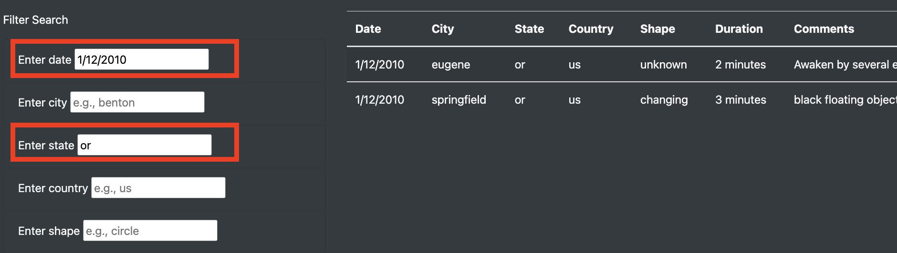

# UFOs

## Overview

We use JavaScript and HTML to build a website to display UFO sighting data. The website is interactive and allows the user to enter multiple search criteria, for example, by date, city, etc., which are then used to filter the data displayed in a table 

## Results

Using input boxes, the user can enter a single or any combination of the following criteria:
- date
- city
- state
- country
- shape of the object

The D3 JavaScript library allows the script to listen for changes to the input boxes as the user updates the search criteria. When a change is detected, a function is called to read the new input value(s), which are then used to filter the original dataset. Finally, only data matching the search criteria are displayed in the table using HTML tags and Bootstrap styling

## Summary

The search functionality is a good start but can be improved to give a better user experience. A few examples for further development:
1. Remove case sensitivity from search. For example, an input of "CA", "Ca", and "ca" for state should all return the same results 
2. Add a drop-down list of shapes to choose from, rather than asking the user to type in one
3. Allow a search based on a range of dates

